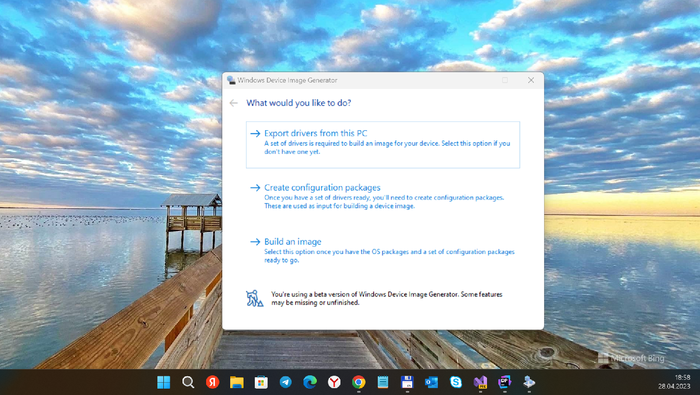
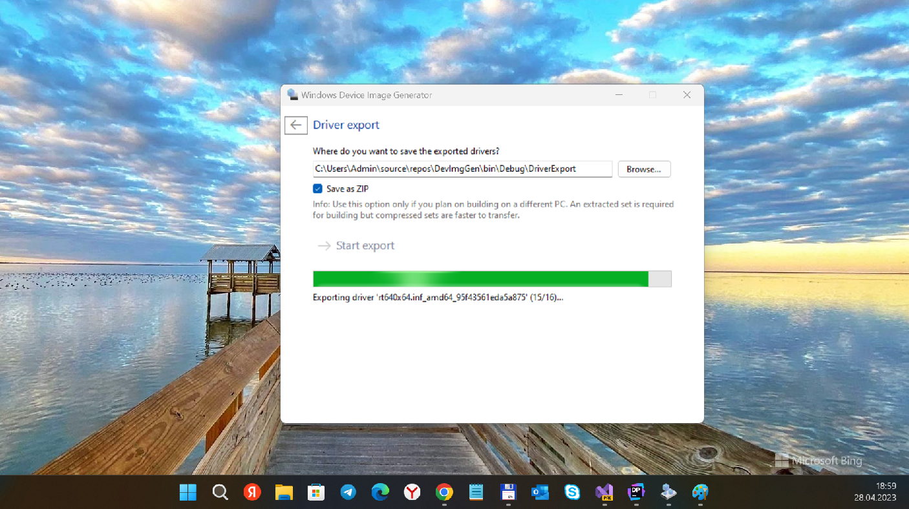

## DevImgGen

Windows Device Image Generator (MiniKit codename)  v1.7

## My 2 cents
- R.E. of devimggen.exe 
- R.E. of diglib.dll

## Screenshot(s)

## How-tos (W10X)
See / Look at Wiki section for some Windows 10x scenorios/use-cases 

## References
- [Albacore](https://github.com/thebookisclosed/)
- [UUPMediaCreator fork](https://github.com/thebookisclosed/UUPMediaCreator)

## ..
As-is. Research only.

## .
-- me 2023
